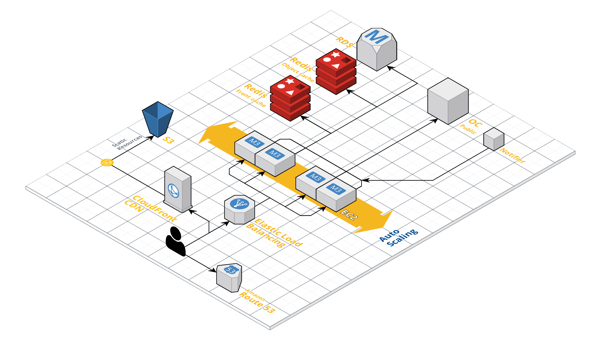

# Architecture

When Everyware is hosted in AWS it uses a number of different AWS services, this page will try to explain the setup. There environment is setup as a Elastic Beanstalk environment, it includes EC2, RDS, Elasticache and more.

Everyware also utilize Imengine which has it's own environment and is not included in this diagram.

### Environment diagram

#### 
Route 53

Used to route end users to the application.

#### CloudFront and static S3 bucket

As a part of the deployment of application code we upload static files such as .js, .css and image assets to an S3 bucket, these are then fetched through CloudFront and cached. Every deploy will set the git commit version as a environment variable that can be used to ensure that all static files are refreshed after deploy.

#### Elastic Load Balancing

Automatically distributes incoming traffic to the different EC2 instances.

#### EC2 instances

This is where the actual application lives, it runs nginx, Openresty and PHP-FPM. At a deployment these are the instances that will get the new application code.

#### Elasticache \(redis\)

A typical Everyware environment includes two Elasticache redis instances, one for the "front-cache" and one for the "object-cache". 

The "front-cache" will store generated HTML and supply it to the users directly through nginx without executing any PHP/Wordpress code if applicable. 

The "object-cache" stores JSON data retrieved from Open Content and protects the Wordpress database from traffic overload.

#### RDS \(MySQL\)

The Wordpress database instance.

#### Open Content

The Open Content that Everyware connects to, this is where we fetch articles, concepts, images and more.

#### OC Notifier

The Open Content Notifier will post events to the Everyware servers, these events are used to update the object cache and more.

