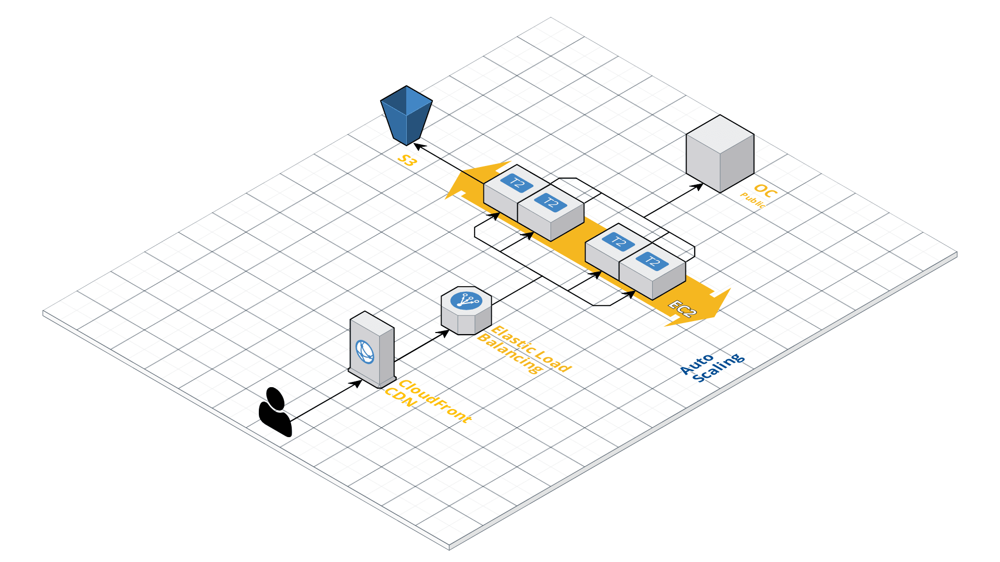

# Imengine

## Product summary 

Imengine is an image handling application it allows cropping and formatting of images from Open Content. It is used in most of Infomakers products such as Everyware, Writer, Apps and more.

It is a PHP application that uses php-gd or php-imagick for the image processing. The application has a number of functions and parameters that affect the image output. It also caches the images on Amazon S3 to reduce the amount of traffic towards Open Content. When used in a production environment a CDN is used in front of Imengine.

It can take crop parameters to soft crop images with data from for example the digital writer.

Example of Imengine environment:

## Documentation

A documentation of the different functions and parameters can be found here:



## Example images

A few examples of Imengine images from our customers using different functions and parameters.

[https://imengine.nv.infomaker.io/?uuid=617520ff-8136-517b-aae5-fbefdec881fc&function=cropresize&type=preview&source=false&q=75&crop\_w=0.99999&crop\_h=0.6015&width=900&height=360&zoom=0&p=1&x=1.0E-5&y=1.0E-5](https://imengine.nv.infomaker.io/?uuid=617520ff-8136-517b-aae5-fbefdec881fc&function=cropresize&type=preview&source=false&q=75&crop_w=0.99999&crop_h=0.6015&width=900&height=360&zoom=0&p=1&x=1.0E-5&y=1.0E-5)

[https://imengine.public.nwt.infomaker.io/?uuid=cb9d2078-871b-5b3f-9826-b940703e1aff&function=hardcrop&type=preview&source=false&q=75&width=700&height=394](https://imengine.public.nwt.infomaker.io/?uuid=cb9d2078-871b-5b3f-9826-b940703e1aff&function=hardcrop&type=preview&source=false&q=75&width=700&height=394)

[https://imengine.tun.infomaker.io/?uuid=334e6236-6f12-5141-81f0-46ac4f924f5e&function=cropresize&type=preview&source=false&q=75&width=980&height=551&x=1.0E-5&y=0.09193&crop\_w=0.99999&crop\_h=0.84428&z=0](https://imengine.tun.infomaker.io/?uuid=334e6236-6f12-5141-81f0-46ac4f924f5e&function=cropresize&type=preview&source=false&q=75&width=980&height=551&x=1.0E-5&y=0.09193&crop_w=0.99999&crop_h=0.84428&z=0)

[http://d6jf7ok6u1qis.cloudfront.net/imengine/image.php?uuid=754a5247-2f0a-5fb5-b664-c52336b0046e&type=preview&source=false&function=cropresize&width=960&height=480&q=40&x=0.0&y=0.03114754098360656&crop\_w=1.0&crop\_h=0.6557377049180327&z=1](http://d6jf7ok6u1qis.cloudfront.net/imengine/image.php?uuid=754a5247-2f0a-5fb5-b664-c52336b0046e&type=preview&source=false&function=cropresize&width=960&height=480&q=40&x=0.0&y=0.03114754098360656&crop_w=1.0&crop_h=0.6557377049180327&z=1)

