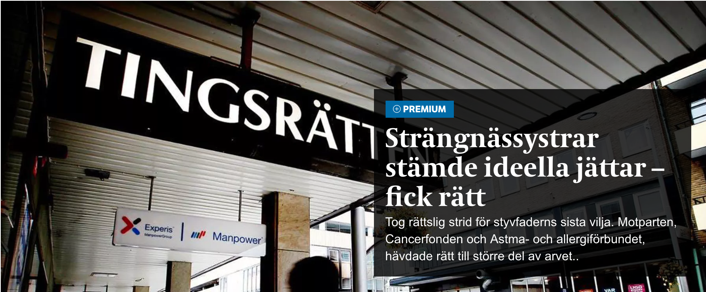

# Task 6 Teaser template

Add a new teaser template and try to reproduce following style to get to know CSS flow, Twig and PHP.


You add new teasers templates under **templates** directory in theme directory



Don't forget to activate template under **Boards =&gt; Board Settings** to use them.


