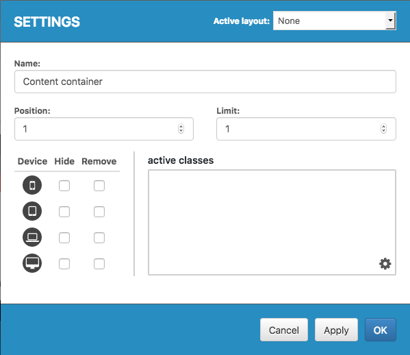

# Content containers

Content Containers is a more technical way of displaying articles on your pages through boards, it has to be supported by code \(a filter that has to be used\). When the code supports it, the page will fetch an array of articles, often for a specific category. This array will be the source of the Content Containers when the board is rendered.

When placing the items in the board the user will be able to configure it to display a subset of the articles in a given position in the board.

### Content Container Item Settings

| Setting | Description |
| :--- | :--- |
| Active layout | Select which teaser template should be used when rendering the articles on the frontend. |
| Name | Set a custom name for the item, only visible in the Everyboard admin interface. |
| Position | Set a starting position for this item, this is the position where the first object in the item will be fetched from the array. |
| Limit | Set how many objects you want this item to display. |

