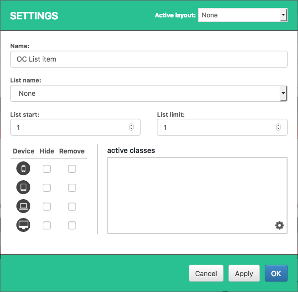

# OC List

OC List is an evolution of what was Everylist, OC Lists are a content type in Open Content and managed via a Dashboard plugin. The Everyboard integration let's the users configure the use of OC List and then to add OC List items to their Everyboards.

When adding a OC List item to an Everyboard you can configure list to use, article template, start position, limit and more. The item will display the articles in the positions configured in the board page. 

### OC List Item Settings

| Setting | Description |
| :--- | :--- |
| Active layout | Select which teaser template should be used when rendering the articles on the frontend. |
| Name | Set a custom name for the item, only visible in the Everyboard admin interface. |
| List name | Select the list you want to fetch articles from. |
| List start | Set a starting position for this item, this is the position where the first article in the item will be fetched from the list. |
| List limit | Set how many articles you want this item to display. |

