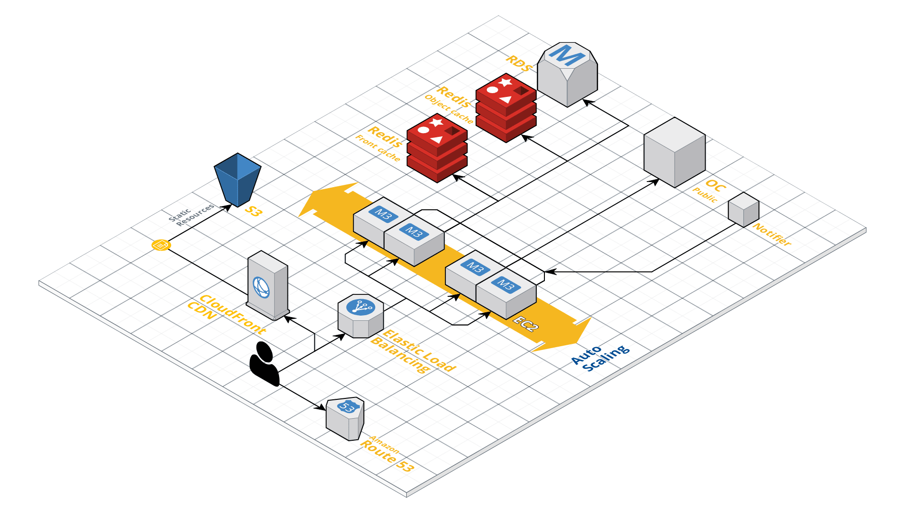

# Everyware

## Demo

[http://site.ew.tryout.infomaker.io](http://site.ew.tryout.infomaker.io)

## Sites using Everyware

Examples of sites using the Everyware platform, hosted in AWS by Infomaker.















## Production Environment

A typical Everyware setup in AWS.

## Publishing flow

How is content published? What does a typical Open Content / Writer setup look like.

